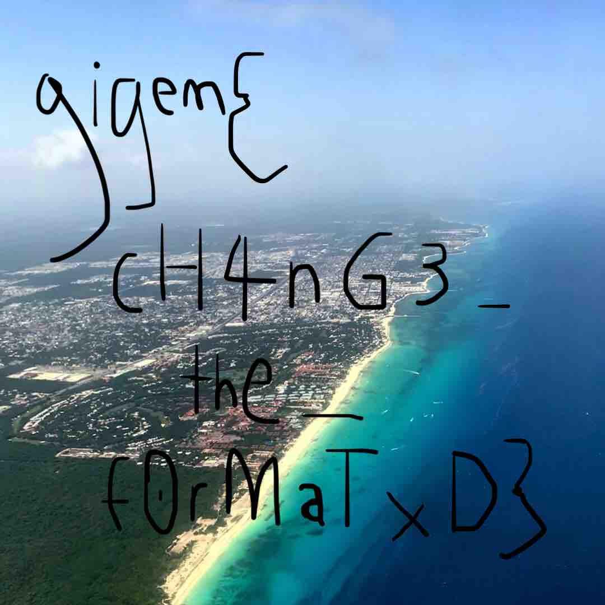

# Instagram Writeup

### TAMUctf 2020 - Misc 50

#### Fix JPEG file

Similar writeup: [SECCON CTF 2017: JPEG File](https://www.pwndiary.com/write-ups/seccon-ctf-2017-jpeg-file-write-up-forensics100/). My goal is to fix jpeg marker. To detect JPEG error, I used [gimp](https://www.gimp.org/downloads/). Locate error by observing the output of gimp, such as:

```
(gimp:27558): GLib-GObject-WARNING **: 23:55:03.929: g_object_set_is_valid_property: object class 'GeglConfig' has no property named 'cache-size'
JPEG image-Warning: Corrupt JPEG data: 1602 extraneous bytes before marker 0xfe

JPEG image-Warning: JPEG datastream contains no image

GIMP-Error: Opening failed: JPEG image plug-In could not open image
```

Use vim with xxd to patch each marker error. `vim -b binaryfile`, `:%!xxd`, `:%!xxd -r`. After five attempts, I get readable image and get flag: 

```
gigem{cH4nG3_the_f0rMaTxD}
```



Original broken image: [photo.jpg](photo.jpg)

Result of trials to get readable image: [photo2.jpg](photo2.jpg), [photo3.jpg](photo3.jpg), [photo4.jpg](photo4.jpg)

Final output: [photo5.jpg](photo5.jpg)