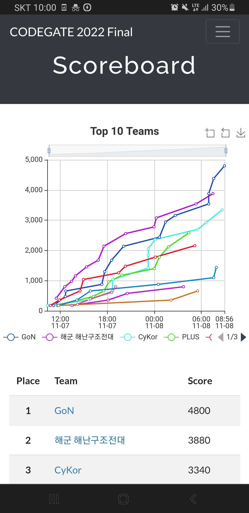

# Capture The Flag - CODEGATE 2022 Finals Blockchain Challenge `Look It Up` Writeup

>  Submitted to KAIST Orakle Blockchain Academy

Hi. The KAIST GoN team [won](https://cs.kaist.ac.kr/board/view?bbs_id=news&bbs_sn=10476&page=1&skey=subject&svalue=&menu=83) the CODEGATE 2022 international hacking defense competition (CTF) held on November 7th and 8th, 2022. Our team consisted of a team of 4 including me, and I contributed by solving problems related to blockchain and cryptography during the finals.

In this article, I would like to introduce CTF, solve the blockchain problem (problem name: `Look It Up`) that was presented in the finals, and deal with the background knowledge to understand it. I hope this article is a pleasant starting point for understanding blockchain security.

If you want to directly go to solutions for `Look It Up` challenge, jump [here](#codegate-2022-final-blockchain-challenge-look-it-up-walkthrough).

## Index

  * [WTF is CTF?](#wtf-is-ctf)
  * [A taste of the CTF problem](#a-taste-of-the-ctf-problem)
  * [CODEGATE 2022 Final Blockchain Challenge `Look It Up` Walkthrough](#codegate-2022-final-blockchain-challenge-look-it-up-walkthrough)
    + [Recon](#recon)
    + [`sanity_check` Analysis](#sanity_check-analysis)
    + [`final_check` Analysis](#final_check-analysis)
    + [Passing `challenge1`](#passing-challenge1)
    + [Passing `challenge2`](#passing-challenge2)
      - [Uniqueness of polynomial factorization on a finite field](#uniqueness-of-polynomial-factorization-on-a-finite-field)
      - [EVM Assembly Analysis](#evm-assembly-analysis)
      - [Transaction Calldata Layout](#transaction-calldata-layout)
      - [Calldata Offset Manipulation to Fix `beta` and `gamma`](#calldata-offset-manipulation-to-fix-beta-and-gamma)
    + [Passing `challenge3`](#passing-challenge3)
      - [EVM Assembly Analysis](#evm-assembly-analysis-1)
      - [Solidity Optimizer Keccak Caching Bug: Confirm `beta == gamma`](#solidity-optimizer-keccak-caching-bug-confirm-beta--gamma)
    + [Getting the long-awaited `flag`](#getting-the-long-awaited-flag)
    + [Wrap Up](#wrap-up)
    + [Exploit Artifacts](#exploit-artifacts)

## WTF is CTF?

CTF stands for Capture The Flag. As one of the information security competitions, it is a competition to solve challenges from various fields such as cryptography, web security, system hacking (Pwnable), and reverse engineering (Reversing). Recently, as blockchain technology evolves and the importance of blockchain security emerges, blockchain security-related issues are appearing in CTF. [Paradigm](https://www.paradigm.xyz/), a famous crypto investment company, also holds [Paradigm CTF](https://ctf.paradigm.xyz/) related to blockchain security every year.

CTF is a very good opportunity to measure and improve our skills by participating from information security experts to newbies. If you're lucky, you might even win a prize like I did. In the process, you can also develop a sense of cooperation because you can cooperate with others. In my opinion, the biggest advantage of CTF is that when unknown knowledge appears, the ability to understand and apply it in a short time without being afraid is developed. It also develops the ability to approach problems without missing out on the smallest details. ~~And it's very amusing~~

CTFs are usually held by universities, companies, or national organizations, and in some cases, individuals hold competitions. From CTF for newbies to CTF for veterans in information security, the difficulty level is very diverse. [CODEGATE CTF](http://codegate.org/sub/introduce), which I participated in, is a famous competition held since 2008, hosted by the Ministry of Science and ICT in South Korea.

Then, let's find out what it means to solve CTF problems and how scoring is done. Problems are made up of programs or data written by the author intentionally introducing vulnerabilities. Problem solvers discover vulnerabilities, read unauthorized data, or manipulate programs into unintended states. As evidence, we look for `flag`. Here, the usual `flag` is a string that is alphanumeric and not too long. For example, `flag{yay_here_is_your_secret}` would be an example. The problem solver submits the `flag` to the author's server and gets points. In general, it is a dynamic scoring method in which the easier the problem is, the more it is solved and the assigned score is lowered. The team with the highest total score during the competition time wins. Below is the actual competition scoreboard.

<p align="center">
    
</p>

## A taste of the CTF problem

Let's take a very simple blockchain problem as an example. The Ethereum smart contract code and its address below will be given to the problem solver.

```solidity
contract Challenge {
    string private flag;

    constructor(string memory _flag) {
        flag = _flag;
    }

    function query() public payable returns (string memory) {
        require(msg.value >= 10000 ether);
        return flag;
    }
}
```

The intent of the problem is clear. We need to figure out the value of `flag`. At first glance, it seems that we have to pay 10000 ETH to get a 'flag' by calling the payable 'query' method. But we don't have that much money. What should I do?

[All data above the smart contract is readable!](https://medium.com/hackernoon/your-private-solidity-variable-is-not-private-save-it-before-it-becomes-public-52a723f29f5e) even if the variable is declared `private`. Using `getStorageAt` Ethereum JSONRPC(`getStorageAt(contract address, 0, latest)`), we can read slot 0th storage to get `flag`! (Assuming that `flag` is less than 32 bytes long. [FYI](https://ethereum.stackexchange.com/questions/107282/storage-and-memory-layout-of-strings)) The problem solver submits the obtained `flag` to the author's server and gets points . Also, the problem solver recalled the important fact that all data on the blockchain can be read even if the private keyword was used.

## CODEGATE 2022 Final Blockchain Challenge `Look It Up` Walkthrough

To learn more and get a `flag`, let's now solve the CODEGATE 2022 final block chain problem `Look It Up` step by step. The contest questions are much harder than the teaser above! Let's break down the problem step by step. Rather than presenting simple answers, I will explain in detail my thoughts in solving the problems during the competition.

### Recon

A Description of the problem.

```
Oh wow, a solidity code. I have zero knowledge on solidity code. Better look it up.

This is deployed using Paradigm CTF 2022's dockerfiles. For example, see

https://github.com/paradigmxyz/paradigm-ctf-2022/tree/main/sourcecode
https://github.com/paradigmxyz/paradigm-ctf-infrastructure
In other words, this is deployed using foundry's default settings. Please test your solutions before deploying the challenge.

Also, make sure to kill your instances after you get the flag.

nc 3.34.81.192 31337
```

After reading the description, it says that the [infrastructure](https://github.com/paradigmxyz/paradigm-ctf-infrastructure) used in Paradigm CTF was used. Let's connect to the given problem endpoint. Using the [`nc`](https://en.wikipedia.org/wiki/Netcat) command, interact with the problem using the given IP and PORT (Currently, the problem server is shut down and cannot connect to the endpoint. Infrastructure can be used to build the same environment).

```sh
$ nc 3.34.81.192 31337
1 - launch new instance
2 - kill instance
3 - get flag
action? 1
ticket please: kaistgonbestteam
```

To tinker with the problem, I entered action(`1`) and ticket(`kaistgonbest`) as Stdin. Stdout to it yields:

```
your private blockchain has been deployed
it will automatically terminate in 30 minutes
here's some useful information
uuid:           13d5525e-d46f-4b30-861c-ab2b16be2eff
rpc endpoint:   http://3.34.81.192:8545/13d5525e-d46f-4b30-861c-ab2b16be2eff
private key:    0xa6855daade7763293890ba6f8aceec84c40811653d22970650db5f7a962e52d3
setup contract: 0x5aB95D9cabC56DA53767904dD1884A918fa17902
```

It is said that a personal blockchain for me has been deployed. I am given a problem setup smart contract address, a private key of the address containing ETH (enough to solve the problem), and an RPC endpoint that can interact with the blockchain.

Along with this, the problem distribution files [Challenge.sol](Challenge.sol) and [Setup.sol](Setup.sol) are given.

`Setup.sol` looks like this:
```solidity
pragma solidity 0.8.0;

import "./Challenge.sol";

contract Setup {
    
    Challenge public challenge;

    constructor() {
        challenge = new Challenge();
    }
    
    function isSolved() public view returns (bool) {
        return challenge.solved();
    }
}
```

You can see that the `isSolved` method is implemented to check if the problem is solved. Making the `isSolved` method return true solves the problem. This can be found in the [source code of the infrastructure](https://github.com/paradigmxyz/paradigm-ctf-infrastructure/blob/08a0f1a0fc3bd1f661ec425021bc46f5bdf9b906/images/eth-challenge-base/eth_sandbox/launcher.py#L181). Internally, the following Python code works to determine whether the problem is solved.

```python
def is_solved_checker(web3: Web3, addr: str) -> bool:
    result = web3.eth.call(
        {
            "to": addr,
            "data": web3.sha3(text="isSolved()")[:4],
        }
    )
    return int(result.hex(), 16) == 1
```

To make the `isSolved` method to return true, let's jump to `Challenge.sol` to see the implementation of `challenge.solved()`. The `Challenge.sol` is:

```solidity
pragma solidity 0.8.0;

contract Challenge {
    uint256 public p = 21888242871839275222246405745257275088548364400416034343698204186575808495617;

    bool public solved = false;
    bool public solved1 = false;
    bool public solved2 = false;
    bool public solved3 = false;

    function isPowerOf2(uint256 n) public pure returns (bool) {
        while(n % 2 == 0) {
            n = n / 2;
        }
        return n == 1;
    }

    function declareSolved() public {
        if(solved1 == true && solved2 == true && solved3 == true) {
            solved = true;
        }
    }

    function sanity_check(uint256 n, uint256[] memory f, uint256[] memory t, uint256[] memory s1, uint256[] memory s2) internal returns (bool) {
        require(isPowerOf2(n + 1), "n + 1 not power of 2");
        require(f.length == n && t.length == n + 1 && s1.length == n + 1 && s2.length == n + 1, "length checks");
        for(uint i = 0 ; i < f.length ; i++) {
            require(0 <= f[i] && f[i] < p);
        }
        for(uint i = 0 ; i < t.length ; i++) {
            require(0 <= t[i] && t[i] < p);
        }
        for(uint i = 0 ; i < s1.length ; i++) {
            require(0 <= s1[i] && s1[i] < p);
        }
        for(uint i = 0 ; i < s2.length ; i++) {
            require(0 <= s2[i] && s2[i] < p);
        }
        return true;
    }

    function final_check(uint256 n, uint256[] memory f, uint256[] memory t, uint256[] memory s1, uint256[] memory s2, uint256 beta, uint256 gamma) internal view returns (bool) {
        uint256 LHS = 1;
        for(uint i = 0 ; i < n ; i++) {
            LHS = mulmod(LHS, 1 + beta, p);
            uint256 mul = (mulmod(gamma, 1 + beta, p) + mulmod(beta, t[i + 1], p) + t[i]) % p;
            LHS = mulmod(LHS, mulmod(mul, gamma + f[i], p), p);
        }
        uint256 RHS = 1;
        for(uint i = 0 ; i < n ; i++) {
            uint256 mul1 = (mulmod(gamma, 1 + beta, p) + mulmod(beta, s1[i + 1], p) + s1[i]) % p;
            uint256 mul2 = (mulmod(gamma, 1 + beta, p) + mulmod(beta, s2[i + 1], p) + s2[i]) % p;
            RHS = mulmod(RHS, mulmod(mul1, mul2, p), p);
        }
        require(LHS == RHS, "check failed");

        for(uint i = 0 ; i < n ; i++) {
            bool ex = false;
            for(uint j = 0 ; j <= n ; j++) {
                if(f[i] == t[j]) {
                    ex = true;
                }
            }
            if(ex == false) return true;
        }
        return false;
    }

    function challenge1(uint256 n, uint256[] memory f, uint256[] memory t, uint256[] memory s1, uint256[] memory s2) public {
        require(sanity_check(n, f, t, s1, s2), "sanity check failed");
        bytes32 beta = keccak256(abi.encode(n, f, t, s1, s2, uint256(1)));
        bytes32 gamma = keccak256(abi.encode(n, f, t, s1, s2, uint256(2)));
        require(final_check(n, f, t, s1, s2, uint256(beta) % p, uint256(gamma) % p), "final check failed");
        solved1 = true;
    }

   function challenge2(uint256 n, uint256[] memory f, uint256[] memory t, uint256[] memory s1, uint256[] memory s2) public {
        require(sanity_check(n, f, t, s1, s2), "sanity check failed");
        uint256 len = (12 + 4 * n) * 0x20;
        bytes32 beta; bytes32 gamma;
        assembly {
            let ptr := mload(0x40)
            calldatacopy(ptr, 4, len)
            mstore(add(ptr, len), 1)
            beta := keccak256(ptr, add(len, 32))
            mstore(add(ptr, len), 2)
            gamma := keccak256(ptr, add(len, 32))
        }
        
        require(final_check(n, f, t, s1, s2, uint256(beta) % p, uint256(gamma) % p), "final check failed");
        require(s1[n] == s2[0], "middle equality check failed");
        solved2 = true;
    }

  function challenge3(uint256 n, uint256[] memory f, uint256[] memory t, uint256[] memory s1, uint256[] memory s2) public {
        bytes32 beta; bytes32 gamma;
        for(uint i = 0 ; i < 4 * n + 7 ; i++) {
            assembly {
                let ptr := mload(0x40)
                mstore(ptr, beta)
                mstore(add(ptr, 32), gamma)
                mstore(add(ptr, 64), mload(add(0x80, mul(i, 32))))
                mstore8(add(ptr, 96), 1)
                mstore8(add(ptr, 97), 2)
                beta := keccak256(ptr, 97)
                gamma := keccak256(ptr, 98)
            }
        }
        require(sanity_check(n, f, t, s1, s2), "sanity check failed");    
        require(final_check(n, f, t, s1, s2, uint256(beta) % p, uint256(gamma) % p), "final check failed");
        require(s1[n] == s2[0], "middle equality check failed");
        solved3 = true;
    }
}
```

This is 114 lines of Solidity code. The goal of the problem is to make the `solved` bool variable true. That's because to make the `isSolved` method of the Setup contract return true. So let's see where we taint the `solved` bool variable. The `declareSolved` method below is the only one.

```solidity
function declareSolved() public {
    if(solved1 == true && solved2 == true && solved3 == true) {
        solved = true;
    }
}
```

I need to set all the `solved1`, `solved2`, `solved3` bool variables to true. To do this, we must call `challenge1`, `challenge2`, `challenge3` with inputs that all passes `require`. In summary, this problem has three subproblems, each of which does not affect the others. Let's solve these three `challenges' that seem math-heavy. Will think by moving the form expressed in code into a mathematical expression.

Before approaching the problem in earnest, there are basic things to check. We first check the version of the Solidity compiler which is used. As of `pragma solidity 0.8.0;`, integer overflow detection is [built-in](https://solidity-by-example.org/hacks/overflow/) into the language itself. Also, we can check the similarity between each `challenge`. Both the `sanity_check` method and the `final_check` method must be passed. Let's analyze these common methods first.

$p$ presented in the problem is a [prime](http://factordb.com/index.php?query=21888242871839275222246405745257275088548364400416034343698204186575808495617) with a size of 254 bits. In order to check the mathematical properties of $p$, $p - 1, p + 1$ was factorized to check [smoothness](https://en.wikipedia.org/wiki/Smooth_number), but there were no useful properties.

### `sanity_check` Analysis

Method arguments must satisfy the following conditions.

1. $n + 1$ is a power of 2.
2. The length of $f$ is $n$. The length of $t$, $s_{1}$, and $s_{2}$ is $n + 1$.
3. Elements that make up $f$, $t$, $s_{1}$, and $s_{2}$ are [finite field](https://en.wikipedia.org/wiki/Finite_field) $GF(p )$ elements(all must be non-negative integers less than $p$). It is because $p$ is prime.

### `final_check` Analysis

Compared to the `sanity_check` method, the $\beta$ and $\gamma$ variables are added. The logic of each `challenge` calculates these two variables and leaves the `final_check` method to check. The following equation $A$ must be satisfied to pass through the method. All calculations are done on $GF(p)$.

$$ (1 + \beta)^{n} \prod_{i=0}^{n} (\gamma (1 + \beta) + t[i + 1] \beta + t[i]) \prod_{i=0}^{n} (\gamma + f[i]) = \newline 
\prod_{i=0}^{n} (\gamma (1 + \beta) +  s_{1}[i + 1] \beta + s_{1}[i]) \prod_{i=0}^{n} (\gamma (1 + \beta) + s_{2}[i + 1] \beta + s_{2}[i]) \quad \cdots \quad A
$$

Also, the intersection of the elements of $t$ and the elements of $f$ must be empty. Simply put, the elements contained in $t$ must not be contained in $f$ and vice versa.

### Passing `challenge1`

$\beta$ and $\gamma$ are calculated as:

```solidity
bytes32 beta = keccak256(abi.encode(n, f, t, s1, s2, uint256(1)));
bytes32 gamma = keccak256(abi.encode(n, f, t, s1, s2, uint256(2)));
```

Since the [`keccak256`](https://en.wikipedia.org/wiki/SHA-3) method is the [Cryptographic Hash Function (CHF)](https://en.wikipedia.org/wiki/Cryptographic_hash_function), [avalanche effect](https://en.wikipedia.org/wiki/Avalanche_effect) is satisfied. In simple terms, even if the input changes slightly, the output changes a lot (with a 50% chance each bit in the output is flipped). Also, the `abi.encode` method encodes various data [including dynamic types](https://docs.soliditylang.org/en/v0.8.0/abi-spec.html). We avoid abi collision using encoding. `abi.encode` is an [affine function](https://mathworld.wolfram.com/AffineFunction.html) with a one-to-one correspondence (bijectivity). To put it simply, it is a transformation in which the output is of the form $ax + b$ when the given input is $x$.

By performing the above mathematical considerations, it is concluded that no matter what values are used for $n, f, t, s_{1}, s_{2}$, the values of $\beta$ and $\gamma$ cannot be made the same. This is because the last argument of `abi.encode` is intentionally set differently to `uint256(1)` and `uint256(2)`, respectively. Let's confirm that $\beta \neq \gamma$ and find the appropriate $n, f, t, s_{1}, s_{2}$ values.

Observe that the following three terms have a similar structure.

$$ \prod_{i=0}^{n} (\gamma (1 + \beta) + t[i + 1] \beta + t[i]), \prod_{i=0}^{n} (\gamma (1 + \beta) +  s_{1}[i + 1] \beta + s_{1}[i]),  \prod_{i=0}^{n} (\gamma (1 + \beta) + s_{2}[i + 1] \beta + s_{2}[i]) $$

Set the values of $t$ and $s_{1}$ equal to simplify the equation $A$ which must be satisfied.

$$ (1 + \beta)^{n} \prod_{i=0}^{n} (\gamma + f[i]) = \prod_{i=0}^{n} (\gamma (1 + \beta) + s_{2}[i + 1] \beta + s_{2}[i])
$$

Through observation, by setting all elements of $f$ and $s_{2}$ to $0$, it is confirmed that the transformed equation holds.

$$ (1 + \beta)^{n} \prod_{i=0}^{n} \gamma = \prod_{i=0}^{n} (\gamma (1 + \beta)) $$

In summary, regardless of the values of $\beta, \gamma, n$, if only $t = s_{1}$ is satisfied, `challenge1` can be solved. The actual values of the elements of $n$, $t$ and $s_{1}$ were arbitrarily set to satisfy the conditions outlined above. It was confirmed that the elements of $f$ and $t$ do not overlap.

$$ n = 1, f = [0], t = [1, 1], s_{1} = [1, 1], s_{2} = [0, 0] $$

So far it looks like a simple math problem. Let's move on to the next `challenge`.

### Passing `challenge2`

The logic for calculating $\beta$ and $\gamma$ compared to `challenge1` has been replaced with a Solidity inline assembly. Similar to `challenge1`, it computes $\beta$ and $\gamma$ with the `keccak256` opcode. So, why not use the result of `challenge1` as it is? Not a chance. The following `require` is added.

```solidity
require(s1[n] == s2[0], "middle equality check failed");
```

The newly added contraint gives me a headache. It is not easy to find an input that satisfies $s_{1}[n] = s_{2}[0]$ even with a long manual calcuation. Let's think more mathematically. $\beta$ and $\gamma$ change according to the method parameters we input, so $s_{1}[n] = s_{2}[0]$ must be satisfied regardless of the values of $\beta$ and $\gamma$. We begin to question the existence of $n, f, t, s_{1}, s_{2}$ that satisfy the condition.

#### Uniqueness of polynomial factorization on a finite field

Among the $2n$ polynomials forming the right side of $A$, lets pick the polynomial affected by $s_{1}[n], s_{2}[0]$. Let $P(\beta, \gamma) = (\gamma(1 + \beta) + s_{1}[n] \beta + s_{1}[n - 1])$, $Q(\beta, \gamma) = (\gamma(1 + \beta) + s_{2}[1] \beta + s_{2}[0])$. $P$ and $Q$ are polynomials which are affected. Both expressions are linear with respect to $\beta, \gamma$. To cancel out the effect of the above two terms, let's observe the left side of the equation $A$.

$$ (1 + \beta)^{n} \prod_{i=0}^{n} (\gamma (1 + \beta) + t[i + 1] \beta + t[i]) \prod_{i=0}^{n} (\gamma + f[i]) $$

By distributing $(1 + \beta)^{n}$, we get the following formula. The reason for the distribution is to match the order of terms related with $\beta$ and $\gamma$.

$$ \prod_{i=0}^{n} (\gamma (1 + \beta) + t[i + 1] \beta + t[i]) \prod_{i=0}^{n} (\gamma (1 + \beta) + f[i] \beta + f[i]) $$

Of the $2 n$ polynomials constituting the left side of $A$, $P$ and $Q$ on the right side correspond to two polynomials. Observing the coefficients of $2n - 2$ polynomials forming the right side, excluding $P$ and $Q$, $s_{1}[i]$ and $s_{2}[i]$ for $i$ in $0 < i < n$ will be used twice each in the polynomial.

By this property, below two condition is derived.

$$P(\beta, \gamma) \mid \Pi_{i=0}^{n} (\gamma (1 + \beta) + t[i + 1] \beta + t[i]) $$

$$Q(\beta, \gamma) \mid \Pi_{i=0}^{n} (\gamma (1 + \beta) + f[i] \beta + f[i]) $$

The position of $P$ and $Q$ can be interchanged. This means that $P$ and $Q$ cannot be placed leaning to one side. Then, since $s_{1}[n] = s_{2}[0]$ must be satisfied, the condition that the intersection of the elements of $t$ derived from `final_check` and the elements of $f$ is an empty set can't be satisfied. All of these arguments are based on the fact that the [polynomial factorization on a finite field](https://en.wikipedia.org/wiki/Factorization_of_polynomials_over_finite_fields) is unique.

#### EVM Assembly Analysis

If so, the assumption made above is wrong. Naturally, we start thinking about why the logic for calculating $\beta$ and $\gamma$ has changed. Let's take a look at the inline assembly step by step to check again whether $\beta$ and $\gamma$ are really determined according to the method arguments we entered. Let's refer to [EVM Opcode Specification](https://ethervm.io/).

```solidity
uint256 len = (12 + 4 * n) * 0x20;
bytes32 beta; bytes32 gamma;
assembly {
    let ptr := mload(0x40)
    calldatacopy(ptr, 4, len)
    mstore(add(ptr, len), 1)
    beta := keccak256(ptr, add(len, 32))
    mstore(add(ptr, len), 2)
    gamma := keccak256(ptr, add(len, 32))
}
```


1. `mload(0x40)`: `ptr = memory[0x40:0x40 + 32]`. In `0x40`, EVM's [free memory pointer](https://ethereum.stackexchange.com/questions/9603/understanding-mload-assembly-function) is stored. It is to first secure the location of memory necessary for calculation.
2. `calldatacopy(ptr, 4, len)`: `memory[ptr:ptr + len] = msg.data[4:4 + len])`. That is, from the `4`th (0 indexed) byte of transaction calldata to `4 + len` bytes are copied to memory.
3. `mstore(add(ptr, len), 1)`: `memory[ptr + len: ptr + len + 32] = 1`. Paste `1` directly to the previously copied memory.
4. `beta := keccak256(ptr, add(len, 32))`: `beta = keccak256(memory[ptr:ptr + len + 32])`. Hash the data which were explicitly written in memory and store the result in `beta`. The reason for adding 32 is that 32 bytes were used when `1` was written earlier.
5. `mstore(add(ptr, len), 2)`: `memory[ptr + len:ptr + len + 32] = 2`. Where `1` was written, write `2` again.
6. `gamma := keccak256(ptr, add(len, 32))`: `gamma = keccak256(memory[ptr:ptr + len + 32])`. Hash the data which were explicitly written in memory and store the result in `gamma`. The reason for adding 32 is the same as number 4.

`len = (12 + 4 * n) * 0x20` in this case. Since the [`calldatacopy`](https://ethervm.io/#37) instruction was used, let's check the structure of the transaction calldata. $\beta$ and $\gamma$ were obtained by using partial calldata (`msg.data[4:4 + len]`).

#### Transaction Calldata Layout

Here is a [detailed article](https://degatchi.com/articles/reading-raw-evm-calldata) dealing with the structure of calldata. Let's understand calldata structure by referring to this content. Let's first create a calldata which method `function challenge2(uint256 n, uint256[] memory f, uint256[] memory t, uint256[] memory s1, uint256[] memory s2)` is called with the following arguments. It cannot pass `challenge2`, but it is for figuring out the calldata structure.

$$ n = 3, f = [1, 2, 3], t = [4, 5, 6, 7], s_{1} = [8, 9, 10, 11], s_{2} = [12, 13, 14, 15] $$

Create calldata using [web3py](https://web3py.readthedocs.io/en/v5/) and [py-solc-x](https://solcx.readthedocs.io/en/latest/). Below is the python code that cuts the calldata in units of 32 bytes, excluding the `0x` prefix and function selector.

```python
from solcx import compile_source, install_solc
from web3 import HTTPProvider, Web3

web3 = Web3()

install_solc(version="0.8.0")

with open("Challenge.sol") as f:
    source = f.read()

compiled_sol = compile_source(source, output_values=["abi", "bin"])

challenge = web3.eth.contract(
    abi=compiled_sol["<stdin>:Challenge"]["abi"],
    bytecode=compiled_sol["<stdin>:Challenge"]["bin"],
)

n = 0x3
f = [0x1, 0x2, 0x3]
t = [0x4, 0x5, 0x6, 0x7]
s1 = [0x8, 0x9, 0xa, 0xb]
s2 = [0xc, 0xd, 0xe, 0xf]

calldata = challenge.functions.challenge2(n, f, t, s1, s2)._encode_transaction_data()
# remove 0x prefix and remove function selector b6ebb13b
layout = bytes.fromhex(calldata.lstrip("0x"))[4:]
for i in range(len(layout) // 32):
    print("{:03x}".format(i * 32), layout[32 * i : 32 * i + 32].hex())
```

The result is presented below. The input parameters are stacked, from `0x1` to `0xf`. There are other values which are not input arguments. Eventually, the EVM parses the calldata below and calls the method using the function selector. According to [ABI specification](https://docs.soliditylang.org/en/v0.8.0/abi-spec.html#abi), let's comment what each 32 (0x20) bytes mean. $f, t, s_{1}, s_{2}$ are [dynamic type](https://docs.soliditylang.org/en/v0.8.0/abi-spec.html#use-of-dynamic-types) except for $n$. Observing the calldata structure helps us to understand how arguments are passed to EVM Stack Machine when calling a method. Regarding dynamic type, in order for EVM to parse data from calldata, we can notice that calldata includes argument length and offset. A total of 24 lines of 32 bytes were the final output.

```
000 0000000000000000000000000000000000000000000000000000000000000003    # 1st argument: n = 0x3
020 00000000000000000000000000000000000000000000000000000000000000a0    # 2nd argument offset: f starts at 0x0a0
040 0000000000000000000000000000000000000000000000000000000000000120    # 3rd argument offset: t starts at 0x120
060 00000000000000000000000000000000000000000000000000000000000001c0    # 4th argument offset: s1 starts at 0x1c0
080 0000000000000000000000000000000000000000000000000000000000000260    # 5th argument offset: s2 starts at 0x260
0a0 0000000000000000000000000000000000000000000000000000000000000003    # 2nd argument: f.length = 0x3
0c0 0000000000000000000000000000000000000000000000000000000000000001    # 2nd argument: f[0] = 0x1
0e0 0000000000000000000000000000000000000000000000000000000000000002    # 2nd argument: f[1] = 0x2
100 0000000000000000000000000000000000000000000000000000000000000003    # 2nd argument: f[2] = 0x3
120 0000000000000000000000000000000000000000000000000000000000000004    # 3rd argument: t.length = 0x4
140 0000000000000000000000000000000000000000000000000000000000000004    # 3rd argument: t[0] = 0x4
160 0000000000000000000000000000000000000000000000000000000000000005    # 3rd argument: t[1] = 0x5
180 0000000000000000000000000000000000000000000000000000000000000006    # 3rd argument: t[2] = 0x6
1a0 0000000000000000000000000000000000000000000000000000000000000007    # 3rd argument: t[3] = 0x7
1c0 0000000000000000000000000000000000000000000000000000000000000004    # 4th argument: s1.length = 0x4
1e0 0000000000000000000000000000000000000000000000000000000000000008    # 4th argument: s1[0] = 0x8
200 0000000000000000000000000000000000000000000000000000000000000009    # 4th argument: s1[1] = 0x9
220 000000000000000000000000000000000000000000000000000000000000000a    # 4th argument: s1[2] = 0xa
240 000000000000000000000000000000000000000000000000000000000000000b    # 4th argument: s1[3] = 0xb
260 0000000000000000000000000000000000000000000000000000000000000004    # 5th argument: s2.length = 0x4
280 000000000000000000000000000000000000000000000000000000000000000c    # 5th argument: s2[0] = 0xc
2a0 000000000000000000000000000000000000000000000000000000000000000d    # 5th argument: s2[1] = 0xd
2c0 000000000000000000000000000000000000000000000000000000000000000e    # 5th argument: s2[2] = 0xe
2e0 000000000000000000000000000000000000000000000000000000000000000f    # 5th argument: s2[3] = 0xf
```

When calculating $\beta$ and $\gamma$ earlier, partial calldata (`msg.data[4:4 + len]`), `len = (12 + 4 * n) * 0x20` was used. In the example above, $n = 3$, so `len = (12 * 4 * 3) * 0x20 = 24 * 0x20`, that is, all calldata printed above are based on `msg.data[4:4 + len]`.

#### Calldata Offset Manipulation to Fix $\beta$ and $\gamma$

If $\beta$ and $\gamma$ are fixed values regardless of input arguments, and if they are known values, is it easy to find an input that satisfies the equations $A$ and $s_{1}[n] = s_{2}[0]$? As we did in `challenge1`, let's observe the equation $A$ again.

$$ (1 + \beta)^{n} \prod_{i=0}^{n} (\gamma (1 + \beta) + t[i + 1] \beta + t[i]) \prod_{i=0}^{n} (\gamma + f[i]) = \newline 
\prod_{i=0}^{n} (\gamma (1 + \beta) +  s_{1}[i + 1] \beta + s_{1}[i]) \prod_{i=0}^{n} (\gamma (1 + \beta) + s_{2}[i + 1] \beta + s_{2}[i]) \quad \cdots \quad A
$$

If the values of $\beta$ and $\gamma$ are known, and if these values are constants, then it becomes very easy to find the inputs $n, f, t, s_{1}, s_{2}$ that satisfy the above expression. Simply thinking, let's make both the left and right sides of the equation $A$ to $0$.

$$ f[0] = -\gamma, s_{2}[n - 1] = 0, s_{2}[n] = - \gamma(1 + \beta)$$

Using the values above, we can see that both the left and right sides will be $0$ regardless of the rest of the input. The thing to note here is that all elements of the argument must be in $GF(p)$, so when using the actual value, we must use the remainder divided by $p$. So, how do we set $\beta$ and $\gamma$ to constants whose values are known, independent of the input arguments?

Surprisingly, it is possible by manipulating the structure of the calldata layout described above. `msg.data[4: 4 + len]` is used for $\beta$ and $\gamma$. If we can make the value of `msg.data[4: 4 + len]` a constant while passing the method arguments $n, f, t, s_{1}, s_{2}$ normally, we can set $\beta$ and $\gamma$ to constants whose values we know. This is because `msg.data[4: 4 + len]` has been changed to an independent constant that is not affected by $\beta$ and $\gamma$. Let's look again at the comments we made in the calldata layout.

The part indicating the start position of the calldata corresponding to the second argument $f$ and the value included in $f$ is as follows.

```
...
020 00000000000000000000000000000000000000000000000000000000000000a0    # 2nd argument offset: f starts at 0x0a0
...
0a0 0000000000000000000000000000000000000000000000000000000000000003    # 2nd argument: f.length = 0x3
0c0 0000000000000000000000000000000000000000000000000000000000000001    # 2nd argument: f[0] = 0x1
0e0 0000000000000000000000000000000000000000000000000000000000000002    # 2nd argument: f[1] = 0x2
100 0000000000000000000000000000000000000000000000000000000000000003    # 2nd argument: f[2] = 0x3
...
```

The value contained in calldata can be manipulated by an attacker. In other words, the offset of the argument can also be adjusted. Utilizing this, we modify the offset to write the actual value of $f$ at offset `0x300`. The address containing the value included in the existing $f$ can filled with a random value. I will fill it with `0`.

```
...
020 0000000000000000000000000000000000000000000000000000000000000300    # 2nd argument modified offset: f starts at 0x300
...
0a0 0000000000000000000000000000000000000000000000000000000000000000    # dummy value: 0x0
0c0 0000000000000000000000000000000000000000000000000000000000000000    # dummy value: 0x0
0e0 0000000000000000000000000000000000000000000000000000000000000000    # dummy value: 0x0
100 0000000000000000000000000000000000000000000000000000000000000000    # dummy value: 0x0
...
300 0000000000000000000000000000000000000000000000000000000000000003    # 2nd argument: f.length = 0x3
320 0000000000000000000000000000000000000000000000000000000000000001    # 2nd argument: f[0] = 0x1
340 0000000000000000000000000000000000000000000000000000000000000002    # 2nd argument: f[1] = 0x2
360 0000000000000000000000000000000000000000000000000000000000000003    # 2nd argument: f[2] = 0x3
```

By manipulating calldata like this, you can fix the `msg.data[4:4 + len]` part that affects $\beta$ and $\gamma$ to a constant. So the values of $\beta$ and $\gamma$ are also fixed! We can solve `challenge2` by applying the result obtained earlier. The actual values of $n, f, t, s_{1}, s_{2}$ are set as follows. Let's use the previously derived $f[0], s_{2}[n - 1], s_{2}[n - 2]$, also matching the condition $s_{1}[n] = s_{2}[0]$. Except for these conditions, other arguments were set arbitrarily.

$$ n = 3, f = [-\gamma, 0, 0], t = s_{1} = [1, 2, 3, 4], s_{2} = [4, 0, - \gamma (1 + \beta), 0]$$

In order to find out the fixed $\beta$ and $\gamma$ values, offsets are also modified for the other factors $t, s_{1}, s_{2}$. Fix the value of `msg.data[4:4 + len]` as follows.

```
000 0000000000000000000000000000000000000000000000000000000000000003    # 1st argument: n = 0x3
020 0000000000000000000000000000000000000000000000000000000000000300    # 2nd argument modified offset: f starts at 0x300
040 0000000000000000000000000000000000000000000000000000000000000380    # 3rd argument modified offset: t starts at 0x380
060 0000000000000000000000000000000000000000000000000000000000000420    # 4th argument modified offset: s1 starts at 0x420
080 00000000000000000000000000000000000000000000000000000000000004c0    # 5th argument modified offset: s2 starts at 0x4c0
0a0 0000000000000000000000000000000000000000000000000000000000000000    # dummy value: 0x0
0c0 0000000000000000000000000000000000000000000000000000000000000000    # dummy value: 0x0
0e0 0000000000000000000000000000000000000000000000000000000000000000    # dummy value: 0x0
100 0000000000000000000000000000000000000000000000000000000000000000    # dummy value: 0x0
120 0000000000000000000000000000000000000000000000000000000000000000    # dummy value: 0x0
140 0000000000000000000000000000000000000000000000000000000000000000    # dummy value: 0x0
160 0000000000000000000000000000000000000000000000000000000000000000    # dummy value: 0x0
180 0000000000000000000000000000000000000000000000000000000000000000    # dummy value: 0x0
1a0 0000000000000000000000000000000000000000000000000000000000000000    # dummy value: 0x0
1c0 0000000000000000000000000000000000000000000000000000000000000000    # dummy value: 0x0
1e0 0000000000000000000000000000000000000000000000000000000000000000    # dummy value: 0x0
200 0000000000000000000000000000000000000000000000000000000000000000    # dummy value: 0x0
220 0000000000000000000000000000000000000000000000000000000000000000    # dummy value: 0x0
240 0000000000000000000000000000000000000000000000000000000000000000    # dummy value: 0x0
260 0000000000000000000000000000000000000000000000000000000000000000    # dummy value: 0x0
280 0000000000000000000000000000000000000000000000000000000000000000    # dummy value: 0x0
2a0 0000000000000000000000000000000000000000000000000000000000000000    # dummy value: 0x0
2c0 0000000000000000000000000000000000000000000000000000000000000000    # dummy value: 0x0
2e0 0000000000000000000000000000000000000000000000000000000000000000    # dummy value: 0x0
```

By setting the above values as part of calldata, $\beta$ and $\gamma$ are calculated. The final calldata needs to prepend the appropriate [function selector](https://solidity-by-example.org/function-selector/) to the data above. The value of the function selector of the `challenge2` method was `b6ebb13b`. I wrote a simple test smart contract to get $\beta$ and $\gamma$.

```solidity
pragma solidity 0.8.0;

contract Test {
    uint256 public p = 21888242871839275222246405745257275088548364400416034343698204186575808495617;

    event Calc(bytes32 beta, bytes32 gamma);

    function test2(uint256 n, uint256[] memory f, uint256[] memory t, uint256[] memory s1, uint256[] memory s2) public {
        uint256 len = (12 + 4 * n) * 0x20;
        bytes32 beta; bytes32 gamma;
        assembly {
            let ptr := mload(0x40)
            calldatacopy(ptr, 4, len)
            mstore(add(ptr, len), 1)
            beta := keccak256(ptr, add(len, 32))
            mstore(add(ptr, len), 2)
            gamma := keccak256(ptr, add(len, 32))
        }
        emit Calc(beta, gamma);
    }
}
```

$\beta$ and $\gamma$ are included in the receipt of the transaction executing the `test2` method. The derived values are shown below.

$$ \beta = \texttt{0x19b0d1539797a71ab7ce45e7209ec515ce4cca508bad4b7671b58b1d2509af02} $$

$$ \gamma = \texttt{0x220279eb49199b1cdffbc3b5e4f673d917a9d78aeeeedf464e161556d8b91337} $$

Since $\beta$ and $\gamma$ were obtained, $n, f, t, s_{1}, s_{2}$ were determined and `challenge2` was resolved. It was a problem that required an understanding of calldata layout. For the calldata to be finally sent, the actual argument value should be added after the `msg.data[4:4 + len]` part, which was filled with dummy value after manipulating the offset previously.

```
300 0000000000000000000000000000000000000000000000000000000000000003    # 2nd argument: f.length = 0x3
320 0e61d4879818050cd85482009c8ae484108a10bd8aca914af5cbe03d1746ecca    # f[0] = -gamma % p
340 0000000000000000000000000000000000000000000000000000000000000000    # f[1] = 0x0
360 0000000000000000000000000000000000000000000000000000000000000000    # f[2] = 0x0
380 0000000000000000000000000000000000000000000000000000000000000004    # 3rd argument: t.length = 0x4
3a0 0000000000000000000000000000000000000000000000000000000000000001    # t[0] = 0x1
3c0 0000000000000000000000000000000000000000000000000000000000000002    # t[1] = 0x2
3e0 0000000000000000000000000000000000000000000000000000000000000003    # t[2] = 0x3
400 0000000000000000000000000000000000000000000000000000000000000004    # t[3] = 0x4
420 0000000000000000000000000000000000000000000000000000000000000004    # 4th argument: s1.length = 0x4
440 0000000000000000000000000000000000000000000000000000000000000001    # s1[0] = 0x1
460 0000000000000000000000000000000000000000000000000000000000000002    # s1[1] = 0x2
480 0000000000000000000000000000000000000000000000000000000000000003    # s1[2] = 0x3
4a0 0000000000000000000000000000000000000000000000000000000000000004    # s1[3] = 0x4
4c0 0000000000000000000000000000000000000000000000000000000000000004    # 5th argument: s2.length = 0x4
4e0 0000000000000000000000000000000000000000000000000000000000000004    # s2[0] = 0x4
500 0000000000000000000000000000000000000000000000000000000000000000    # s2[1] = 0x0
520 220ea990c9170f184ca10d4e43567db84935c5b2b82cd5fbfe69633867d82f12    # s2[2] = -gamma * (1 + beta) % p
540 0000000000000000000000000000000000000000000000000000000000000000    # s2[3] = 0x0
```

### Passing `challenge3`

`challenge3` is the last step of the challenge. The logic for calculating $\beta$ and $\gamma$ has been changed as follows. $s_{1}[n] = s_{2}[0]$ and passing `sanity_check`, `final_check` is identical.

```solidity
bytes32 beta; bytes32 gamma;
for(uint i = 0 ; i < 4 * n + 7 ; i++) {
    assembly {
        let ptr := mload(0x40)
        mstore(ptr, beta)
        mstore(add(ptr, 32), gamma)
        mstore(add(ptr, 64), mload(add(0x80, mul(i, 32))))
        mstore8(add(ptr, 96), 1)
        mstore8(add(ptr, 97), 2)
        beta := keccak256(ptr, 97)
        gamma := keccak256(ptr, 98)
    }
}
```

Let's analyze the given EVM Assembly in the same way as `challenge2`.

#### EVM Assembly Analysis

1. `mload(0x40)`: `ptr = memory[0x40:0x40 + 32]`. In `0x40`, EVM's [free memory pointer](https://ethereum.stackexchange.com/questions/9603/understanding-mload-assembly-function) is stored. It is to first secure the location of memory necessary for calculation.
2. `mstore(ptr, beta)`: `memory[ptr:ptr + 32] = beta`.
3. `mstore(add(ptr, 32), gamma)`: `memory[ptr + 32:ptr + 64] = gamma`.
4. `mstore(add(ptr, 64), mload(add(0x80, mul(i, 32))))`: `memory[ptr + 64: ptr + 96] = memory[0x80 + 32 * i: 0x80 + 32 * (i + 1)]`. In `memory[0x80 + 32 * i: 0x80 + 32 * (i + 1)]`, the value of the actual argument parsed from calldata is stored. The code that writes the arguments stored in the calldata to the memory area is not directly implemented by the programmer, but is implemented in advance in the form of an EVM assembly. Since the memory keyword was used in `challenge3(uint256 n, uint256[] memory f, uint256[] memory t, uint256[] memory s1, uint256[] memory s2)`, before the method logic execution, it copies the argument included in calldata to the location at `memory[0x80 + 32 * i: 0x80 + 32 * (i + 1)]`.
5. `mstore8(add(ptr, 96), 1)`: `memory[ptr + 96] = 1`
6. `mstore8(add(ptr, 97), 2)`: `memory[ptr + 97] = 2`
7. `beta := keccak256(ptr, 97)`: `beta = keccak256(memory[ptr, ptr + 97])`, i.e. Hashing `[copied beta | copied gamma | i th parsed calldata | 1] ` and update `beta`.
8. `gamma := keccak256(ptr, 98)`: `gamma = keccak256(memory[ptr, ptr + 98])`, i.e. Hashing `[copied beta | copied gamma | i th parsed calldata | 1 | 2 ]` and update `gamma`.
9. Repeat the logic from 1 to 8 for the parsed calldata while increasing the value of `i`. Since the number of 32 bytes of parsed calldata is `4 * n + 7`, iterates over all given calldata. The values of $\beta$ and $\gamma$ are updated on each iteration.

Unlike `challenge2`, the EVM directly parses the offset and arguments contained inside the calldata. And use that value as it is to calculate $\beta$ and $\gamma$. Depending on the arguments contained in calldata, $\beta$ and $\gamma$ are dependent. It seems that the problem cannot be solved by the [uniqueness of polynomial factorization on a finite field](#Uniqueness-of-polynomial-factorization-on-a-finite-field) analyzed in `challenge2`.

So far, we have read and analyzed the uncompiled code presented directly in the problem. Then it's time to question the EVM bytecode deployed on the actual EVM. Lets make sure that the same code as the symantic of the code I'm reading is running on the blockchain.

#### Solidity Optimizer Keccak Caching Bug: Confirm $\beta = \gamma$

In order for the code presented in the problem to differ from the code operating on the blockchain, there must be a bug in the Solidity compiler that generates EVM bytecode. The latest version of Solidity at the time of the competition is [0.8.17](https://github.com/ethereum/solidity/releases/tag/v0.8.17), but the Solidity version used in the problem is `0.8.0`. Naturally, lets look up the list of bugs patched between the two versions.

While reading all the posts labeled Security Alert posted on [Solidity blog](https://blog.soliditylang.org/), [Solidity Optimizer Keccak Caching Bug](https://blog.soliditylang.org/2021/03/23/keccak-optimizer-bug/) was found. This is a bug that existed in all versions prior to `0.8.3`. A summary of the bug is as follows.

> The bytecode optimizer incorrectly re-used previously evaluated Keccak-256 hashes. You are unlikely to be affected if you do not compute Keccak-256 hashes in inline assembly.

> Specifically, keccak256(mpos1, length1) and keccak256(mpos2, length2) in some cases were considered equal if length1 and length2, when rounded up to nearest multiple of 32 were the same, and when the memory contents at mpos1 and mpos2 can be deduced to be equal.

`challenge3` performs hashing with inline assembly. It matches the problem situation. This is because `beta := keccak256(ptr, 97)`, `gamma := keccak256(ptr, 98)`. If there is a bug, it means that the bytecode corresponding to `beta = gamma := keccak256(ptr, 97)` is generated. Check the bytecode distributed through `getCode` Ethereum JSONRPC (`getCode(contract address, latest)`) to see if the symantic of the code we are reading differs with the code operating on the blockchain, and use [EVM bytecode decompiler](https://ethervm.io/decompile) to check the optimization bug has occurred. Below is the decompiled logic for calculating $\beta$ and $\gamma$.

```solidity
...
var temp4 = memory[0x40:0x60];
memory[temp4:temp4 + 0x20] = var0;
memory[temp4 + 0x20:temp4 + 0x20 + 0x20] = var1;
memory[temp4 + 0x40:temp4 + 0x40 + 0x20] = memory[var2 * 0x20 + 0x80:var2 * 0x20 + 0x80 + 0x20];
memory[temp4 + 0x60:temp4 + 0x60 + 0x01] = 0x01;
memory[temp4 + 0x61:temp4 + 0x61 + 0x01] = 0x02;
var0 = keccak256(memory[temp4:temp4 + 0x61]);
var1 = var0;
...
```

`var0` corresponds to $\beta$ and `var1` corresponds to $\gamma$. By observing the code `var1 = var0;`, it is confirmed that $\beta = \gamma$ because of a bytecode optimizer bug. We can also check it in local environment. After setting the Solidity version to `0.8.0` with [`solc-select`](https://github.com/crytic/solc-select), use the optimization flag `--optimize` in [`solc`](https://www.npmjscom/package/solc) to check the bug is triggered.

```bash
$ solc-select install 0.8.0 && solc-select use 0.8.0
$ solc --optimize Challenge.sol --asm
$ solc Challenge.sol --asm
```

$\beta = \gamma$ checked. Let's use this powerful condition to find the argument values that pass `challenge3`. A python code with the same symantic was written and bruteforcing was conducted. At this time, $n = 3$ was set, and the values of other factors were set to one of $0, 1, and 2$. It was thought that $\beta = \gamma$ condition is so strong, there would be a solution even if the enumeration range was limited to this extent. We set the value of $\beta = \gamma$ to a random number.

```python
import random
from typing import List

from web3 import Web3

p = 21888242871839275222246405745257275088548364400416034343698204186575808495617
n = 3


def H(data: bytes) -> int:
    return Web3.toInt(Web3.soliditySha3(["bytes"], [data]))


def isPowerOf2(n: int) -> bool:
    while n % 2 == 0:
        n = n / 2
    return n == 1


def sanity_check(
    n: int, f: List[int], t: List[int], s1: List[int], s2: List[int]
) -> bool:
    assert isPowerOf2(n + 1)
    assert all([len(f) == n, len(t) == n + 1, len(s1) == n + 1, len(s2) == n + 1])
    assert all(all([0 <= x <= p for x in data]) for data in [f, t, s1, s2])


def final_check(
    n: int,
    f: List[int],
    t: List[int],
    s1: List[int],
    s2: List[int],
    beta: int,
    gamma: int,
) -> bool:
    LHS = 1
    for i in range(n):
        LHS = LHS * (1 + beta) % p
        mul = (gamma * (1 + beta) + beta * t[i + 1] + t[i]) % p
        LHS = LHS * mul * (gamma + f[i]) % p
    RHS = 1
    for i in range(n):
        mul1 = (gamma * (1 + beta) + beta * (s1[i + 1]) + s1[i]) % p
        mul2 = (gamma * (1 + beta) + beta * (s2[i + 1]) + s2[i]) % p
        RHS = RHS * mul1 * mul2 % p
    assert LHS == RHS, "LHS != RHS"
    for i in range(n):
        if all([f[i] != elem for elem in t]):
            return
    assert False, "f and t so equal"


def check3(n: int, f: List[int], t: List[int], s1: List[int], s2: List[int]):
    beta = gamma = random.randint(1, 1 << 128)
    sanity_check(n, f, t, s1, s2)
    final_check(n, f, t, s1, s2, beta, gamma)
    assert s1[n] == s2[0]


def brute() -> None:
    for i in range(3**15):
        val = i
        arr = []
        for _ in range(15):
            arr.append(val % 3)
            val //= 3
        f, t, s1, s2 = arr[:3], arr[3:7], arr[7:11], arr[11:15]
        try:
            check3(n, f, t, s1, s2)
        except:
            continue
        else:
            return f, t, s1, s2
    assert False


if __name__ == "__main__":
    f, t, s1, s2 = brute()
    print(f"{f = }")
    print(f"{t = }")
    print(f"{s1 = }")
    print(f"{s2 = }")
```

My prediction was correct. We were able to find the values of $n, f, t, s_{1}, s_{2}$ within 1 second. The result is:

$$ n = 3, f = [2, 0, 0], t = [1, 0, 0, 0], s_{1} = [0, 1, 1, 0], s_{2} = [0, 0, 0, 0] $$

### Getting the long-awaited `flag`

Lets call `challenge1`, `challenge2` and `challenge3` to set bool variables `solved1`, `solved2` and `solved3` to true, using arguments that passes every `require` condition. We finally call the `declaredSolved` method, making the `solved` bool variable true.

Connect to the problem endpoint again and get the `flag`. It was a long and difficult process.

```bash
$ nc 3.34.81.192 31337
1 - launch new instance
2 - kill instance
3 - get flag
action? 3
ticket please: kaistgonbestteam
codegate2022{1mpr0v1n6_pl00kup_15_h4rd_4f73r_4ll_bu7_47_l3457_w3_h4v3_2022/086_50_ju57_k33p_y0ur_h34r75_w4rm!_4l50_50l1d17y_0.8.3_15_h3r3_70_54v3_u5!}
```

That long string is `flag`. Befitting the difficulty of the problem, even `flag` contains a large amount of information. For reference, using words by mixing similar-looking numbers and alphabets is called [Leetspeak](https://en.wikipedia.org/wiki/Leet). Looking at the contents of `flag`, I learned the following fact.

1. The polynomial above $GF(p)$ presented in the challenge is related to zero knowledge [plonkup](https://eprint.iacr.org/2022/086.pdf). The IACR eprint number is `2022/086`.
    - `1mpr0v1n6_pl00kup_15_h4rd_4f73r_4ll_bu7_47_l3457_w3_h4v3_2022/086_`
2. The attack technique corresponding to `challenge2` is called [frozen heart vulnerability](https://blog.trailofbits.com/2022/04/18/the-frozen-heart-vulnerability-in-plonk/). There is also [CVE-2022-29566](https://nvd.nist.gov/vuln/detail/CVE-2022-29566).
    - `50_ju57_k33p_y0ur_h34r75_w4rm!_`
3. The solidity bug used in `challenge3` has been patched in version `0.8.3`.
    - `4l50_50l1d17y_0.8.3_15_h3r3_70_54v3_u5!`

By parsing the `flag`, I realized that it was a three line summary of the solution to the problem.

### Wrap Up

In summary, it was a high-density problem of introducing zero knowledge plonkup, attack techniques, and solidity bugs. In this article, I did not do a theoretical analysis of plonkup, but it was a good problem that sparked interest in zero knowledge. The properly blended solidity gimmick was also fun.

There is also a [writeup](https://zkresear.ch/t/codegate-ctf-2022-look-it-up-writeup-deeper) written by [rkm0959](https://rkm0959.tistory.com/) who is the problem presenter. The difference from this article is that I solved the problem without understanding zero knowledge. In addition, the presenter created the necessary payload to solve the problem in onchain. If you want to do a deep dive on zero knowledge, I would recommend to understand the commentary of the presenter or read the articles related to zero knowledge that I will write next. Thank you for following through to the end of this eventful long post!

### Exploit Artifacts

The final attack code was written in [solve.py](solve.py). [requirements.txt](requirements.txt) is a dependency. Each `challenge1`, `challenge2`, `challenge3` method solves each step of the problem. To perform an actual attack, as mentioned earlier, you need to build the infrastructure, run the ethereum client, and then deploy the challenge.

Challenge distribution file: [Challenge.sol](Challenge.sol), [Setup.sol](Setup.sol)
