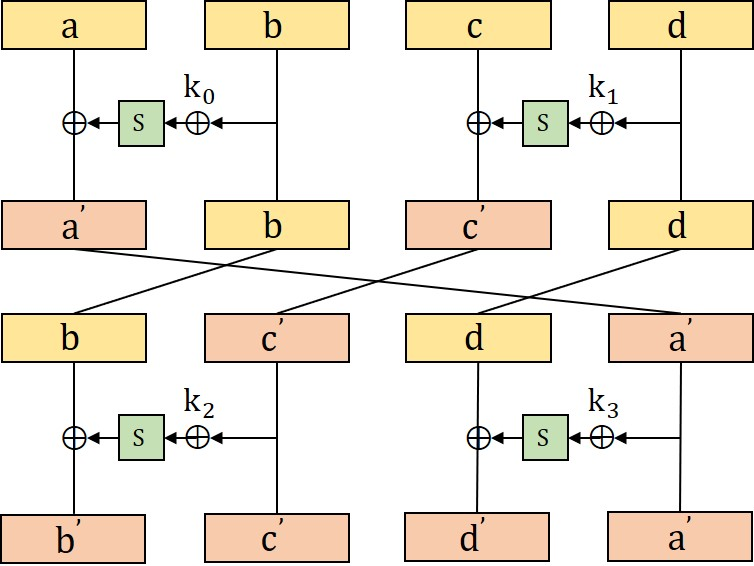

# choreography Writeup
 
### PlaidCTF 2022 - crypto 400 - 15 solves
 
> Let's dance. nc choreography.chal.pwni.ng 1337
 
> [handout](choreography.409bac9b3fc5cd73a5d46b0f2bcf51f4331bdb6094c8d47b39c4d4ea32ad2028.tgz)
 
Solved after the CTF was ended.
 
#### Analysis
 
We have block cipher: `encrypt1` and `encrypt2`. `key` and block size is 4 bytes. Let `key = [k0, k1, k2, k3]`. We can perform chosen ciphertext attack with `QUERIES = 500` queries for each encryption. Our goal is to recover the `key`.
 
The block cipher has the structure of generalized [Feistel structure](https://en.wikipedia.org/wiki/Feistel_cipher), with alternating key setting, having `ROUNDS = 2 ** 22 + 2` performed per each encryption. So large round numbers. The only attack I knew to apply in this tremendously large round setting was [Slide Attack](https://en.wikipedia.org/wiki/Slide_attack). The complexity of slide attack is independent of the number of rounds, and it exploits the fact of weak key structures in iterated-round block ciphers.
 
#### Relation with `encrypt1` and `encrypt2`
 
We can implement the decryption function `decrypt1` of `encrypt1` using `encrypt2`. So, we basically have a plaintext/ciphertext oracle with `QUERIES = 500` queries. Proof:
 
```python
def encrypt1(k, plaintext):
    a,b,c,d = plaintext
    for i in range(ROUNDS):
        a ^= sbox[b ^ k[(2*i)&3]]
        c ^= sbox[d ^ k[(2*i+1)&3]]
        a,b,c,d = b,c,d,a
    return bytes([a,b,c,d])
 
 
def decrypt1(k, ciphertext):
    c,d,a,b = ciphertext
    c,d,a,b = encrypt2(k, bytes([a,b,c,d]))
    return bytes([a,b,c,d])
 
def encrypt2(k, plaintext):
    a,b,c,d = plaintext
    for i in range(ROUNDS)[::-1]:
        b,c,d,a = a,b,c,d
        c ^= sbox[d ^ k[(2*i)&3]]
        a ^= sbox[b ^ k[(2*i+1)&3]]
    return bytes([a,b,c,d])
 
 
key = os.urandom(4)
 
m1 = os.urandom(4)
c1 = encrypt1(key, m1)
m1_ = decrypt1(key, c1)
 
assert m1 == m1_
```
 
#### Deep Dive into Slide Attack
 
Let me visualize each round of `encrypt1`. `a`, `b`, `c` and `d` correspond to each input byte.
 
<p align="center">
  
</p>
 
Each round can be decomposed to two separate sub rounds `r1` and `r2`, which have exactly the same structure but different keys. Also, we notice that for each sub round, half of the input is preserved(`b` and `d` does not change). For each sub round `r1` and `r2`, we use different keys: (`k0` and `k1`) or (`k2` and `k3`). So overall structure is that, running `2 * ROUNDS` sub rounds, with alternating key pairs.
 
We cannot directly apply vanilla [slide attack](https://link.springer.com/content/pdf/10.1007/3-540-48519-8_18.pdf) in this setting and need something fancier.
 
We need to consider two properties:
1. Half of input data is preserved(`b` and `d`), having structure of generalized Feistel structure.
2. Each sub round is alternating, using two different key pairs.
 
#### Complementation Slide + Twisted Slide Attack to the Rescue
 
[Advanced Slide Attack](https://www.iacr.org/archive/eurocrypt2000/1807/18070595-new.pdf) was suitable for the problem setting. We combine two attacks: Complementation Slide and Twisted Slide Attack. Section 3.3 Figure 4 describes the combination between two attacks.
 
To use the generalized Feistel structure, we first study how plain Feistel structure helps to reduce the attack complexity. See Section 3.2 fifth paragraph. The paragraph assumes that the setting is plain feistel structure with alternating key settings. Paragraph:
 
> Moreover, there is a chosen-plaintext/ciphertext variant that allows us to reduce the number of texts down to `2 ** 17` with the use of structures. We generate a pool of `2 ** 16` plaintexts of the form `(Li, R)` and obtain their encryptions. Also, we build a pool of `2 ** 16` ciphertexts of the form `(M0j, N0)` and decrypt each of them, where the value `N0 = R` is fixed throughout the attack. This is expected to give one slid pair, and then the analysis proceeds as before.
 
We now extend the attack for generalized Feistel structures. We have chosen-plaintext/ciphertext variant that allows us to reduce the number of texts down to `2 ** 9` with the use of structure. Generate a pool of `2 ** 8 < 500` plaintext of the form `(a', b, c', d)` and obtain their encryptions, Also, we build a pool of `2 ** 8 < 500` ciphertexts of the form `(a', b, c', d)` and decrypt each of them. This is expected to give one slid pair. and by using up to `500` queries, it is likely to obtain several slid pairs.
 
#### Exploit Plan
 
1. Generate `2 * QUERIES = 1000` data of the form `[a, b, c, d]`. `b` and `d` will be constants, to use the fact that they are preserved after sub rounds. All data must be unique.
2. Send `QUERIES = 500` plaintext obtained from 1, and get ciphertext using encryption oracle.
3. Send `QUERIES = 500` ciphertext obtained from 1, and get plaintext using decryption oracle.
4. Find candidate slide pairs.
    - Let `(A, B)`, `(C, D)` be two ciphertext/plaintext pairs. We can detect candidate slid pairs if `A[1] == D[1]`, `A[3] == D[3]`, `B[1] == C[1]`, `B[3] == C[3]`.
5. Find correct slide pairs by recovering `k0`, `k1` using slid pair `(A, D)`, `(B, C)`. Let `delta` be the difference for Complementation Slide. `delta` is single byte so bruteforcable. Relations:
    - `D[0] = sbox[k0 ^ A[1]] ^ A[0] ^ delta`
    - `D[2] = sbox[k1 ^ A[3]] ^ A[2] ^ delta`
    - `B[0] = sbox[k0 ^ C[1]] ^ C[0] ^ delta`
    - `B[2] = sbox[k1 ^ C[3]] ^ C[2] ^ delta`
6. Recover `k2` and `k3` using `delta`. `k2 ^ k3 == delta`, so bruteforcable, having a search space of single byte.
    - `k2 ^ k3 == delta` because we first make an odd sub round `r1` always line up. By this effect, the even sub round `r2` have the constant difference `delta` to swap effect of `k2` and `k3`.
 
Let `n` bits be block/key size. Time complexity: `O(2 ** (n // 4))`, Space complexity: `O(2 ** (n // 4))`. I get flag(after the CTF was ended :C)
```
PCTF{square_dancin'_the_night_away~}
```
 
Problem src: [cipher.py](cipher.py), [pow.py](pow.py), [run.sh](run.sh)
 
exploit driver code: [solve.py](solve.py)
 

