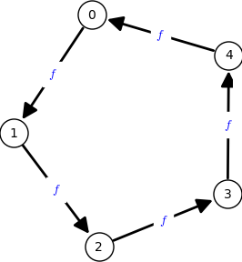

# BBBB Writeup

### DiceCTF 2023 - crypto 199 - 31 solves

> i prefer LCGs over QCGs to be honest... based off [BBB](https://ctftime.org/task/23982) from SECCON CTF 2022

> [bbbb.py](bbbb.py)

#### Analysis

Below is the problem logic.

* Step 1: Key Generation
    - The challenge first initializes [lcg](https://en.wikipedia.org/wiki/Linear_congruential_generator) as the form $X_{n + 1} = f(X_{n}) = a X_{n} + b \mod p$, where $X$ is the sequence of random values and $p$ is $1024$ bit prime. $b$ and $p$ are given, and we have power to control $a$.
    - Let $k$ in `range(5)`.
    - Five RSA public key pairs $N_{k}, e_{k}$ are generated. Public modulus $N_{k}$ is $2048$ bits. Each $e_{k}$ is generated using the lcg, asking the attacker to input seed $X_{0}$ for lcg. lcg state advances `t = randint(10, 100)` times, and the final output $X_{t}$ will be the public exponent $e_{k}$ for [RSA](https://en.wikipedia.org/wiki/RSA_(cryptosystem)) each. Denote each seed as $s_{k}$.
    - Generated $e_{k}$ must be greater than $10$.
* Step 2: Encryption
    - `FLAG` is read from file, asserting that the length is less than $50$.
    - Random padding `PAD = urandom(4)` is right-appended to `FLAG`.
    - For each five RSA public keys, again random padding `r_k = urandom(16)` is right-appended to plaintext. The final plaintext form is $m_k$ = `FLAG + PAD + r_k`, which has max length as $49 + 4 + 16 = 69$. Note that `PAD` is fixed for every plaintext, but $r$ differs. The final plaintext is encrypted using $k$th RSA public key, resulting in ciphertext as $c_{k}$.
    - Each $(n_{k}, e_{k}, r_{k}, c_{k})$ pair is given to the attacker.

#### Control seed and $a$ to fix $e = 11$

Becaue all public modulus $n_{k}$ differs, it seems that the only way to get flag is using [Hastad's Broadcast Attack](https://en.wikipedia.org/wiki/Coppersmith%27s_attack#H%C3%A5stad's_broadcast_attack). To apply this, we must make all public keys share the same public exponent $e$, and $e$ must be small.

The smallest value we can use is $e = 11$. We can control $a$ and seed $s_{k}$ to make the final rng state be $e = 11$ by high probability. Let $X_{i}, X_{i + 1}, X_{i + 2}, X_{i + 3}, X_{i + 4}$ be consecutive lcg states for some non-negative integer $i$. If we meticulously choose $a$ to make a cycle: $f(X_{i + 4}) = X_{i}$ for every non-negative integer $i$, and set seed $s_{k}$ to be these vertices, we can get final state be $e$ in 100%/5 = 20% probability. Final state will be randomly selected in these five elements because of the number of lcg state advancement is random(`t = randint(10, 100)`). This is all possible because lcg is a permutation(every indegree and outdegree is $1$).

<p align="center">
    
</p>

We derive $a$ by following formula.

$$X_{i + 1} = a X_{i} + b$$

$$X_{i + 2} = a X_{i + 1} + b$$

$$X_{i + 3} = a X_{i + 2} + b$$

$$X_{i + 4} = a X_{i + 3} + b$$

$$X_{i} = a X_{i + 4} + b$$

Pair up each equations to get rid of $b$:

$$X_{i + 2} - X_{i + 1} = a (X_{i + 1} - X_{i})$$

$$X_{i + 3} - X_{i + 2} = a (X_{i + 2} - X_{i + 1})$$

$$X_{i + 4} - X_{i + 3} = a (X_{i + 3} - X_{i + 2})$$

$$X_{i} - X_{i + 4} = a (X_{i + 4} - X_{i + 3})$$

$$X_{i + 1} - X_{i} = a (X_{i} - X_{i + 4})$$

Assuming that $X_{i}, X_{i + 1}, X_{i + 2}, X_{i + 3}, X_{i + 4}$ is distinct, $a$ satisfies the following equation.

$$ a ^ 5 = 1 \mod p $$

We use [sagemath](https://www.sagemath.org)'s `roots()` method to calculate $a$. The method usually finds the roots of polynomials, but not always. If we fail, get new parameters $a$ and $p$ by reinitiating the connection. Below is the sagemath code to get $a$. We ignore the trivial root $1$.

We derive seeds using $a, b, p$. Seeds will be elements $X_{i} = e, X_{i + 1}, X_{i + 2}, X_{i + 3}, X_{i + 4}$. Advance four times from initial state $e$, and store the output state as seeds.

Below is the relevant logic implemented to get $a$ and seeds $s_{k}$ from $b$ and $p$.

```python
def gen_cycle(p, b):
    e = 11
    R.<x> = PolynomialRing(Zmod(p), "x")

    eq = x**5 - 1
    roots = eq.roots()
    for root, _ in roots:
        if root == 1:
            continue
        a = root
        seeds = [e]
        for i in range(4):
            seeds.append(rng(a, seeds[-1], b, p))
        if len(set(seeds)) != len(seeds):
            continue
        assert rng(a, seeds[-1], b, p) == seeds[0]
        return a, seeds

    assert False
```

#### Coppersmith Attack

We supply $a$ and seeds $s_{k}$ to fix $e_{k}$ as $e = 11$, each with probability as 20%. We have five public keys, so in order to fix every key, the expected trials to set all public exponents as $e = 11$ will be $5 ^ 5 = 3125$. This is too much.

We need to calculate the minimum number $T$ of $(n_{k}, e_{k}, r_{k}, c_{k})$ pairs. Each pair gives at most $2048 ( 1 /  e - \epsilon)$ information to find hidden bits, by applying [Coppersmith attack](https://en.wikipedia.org/wiki/Coppersmith%27s_attack#Coppersmith_method). $e$ will be the degree of monic polynomial: $x ^ e - c = 0 \mod N$.

Lets revisit the final plaintext form: $m_k$ = `FLAG + PAD + r_k`, which having max length as $49 + 4 + 16 = 69$. We know the value of $r_k$, and also know the prefix of `FLAG` is `dice{`. By using prefix info, the hidden bytes $x$ to recover is at most $69 - \texttt{len("dice\\{")} - \texttt{len(r)} = 69 - 5 - 16 = 48$, or $384$ bits. We get the following inequality:

$$ \texttt{Hidden information max length} = 384 < T \times \frac{2048}{e} = \texttt{\\# of pt-ct pairs} \times \texttt{information recovered per pair}$$

$T > 384 e / 2048 \simeq 2.0625$. We can feasibly recover `FLAG` by using the Coppersmith attack using $T = 3$. The expected trials to set only three public exponent as $e = 11$ will be $5 ^ 3 = 125$, which is much more feasible then setting every $e = 11$.

We now apply the Coppersmith attack. We do not know the exact length of the flag, so bruteforcing the `FLAG` length $L$ is required. Combine all information using [Chinese remainder theorem](https://en.wikipedia.org/wiki/Chinese_remainder_theorem). Combination process is somewhat related with [generalization of Hastad's broadcast attack](https://en.wikipedia.org/wiki/Coppersmith%27s_attack#Generalizations). Each pre-combined monic polynomial will be the following form.

$$(2 ^ {8 \times \texttt{len(r)} } x + r + C) ^ e - c = 0 \mod N$$

where $C$ is the constant for taking care of the prefix `dice{`.

Below is the relevant logic implemented to bruteforce over $L$ and applying Coppersmith attack to recover flag:

```python
def hastad(ns, rs, cs):
    e = 11
    # do not know the exact length of flag
    for L in reversed(range(30, 44)):
        pwn.log.info(f"{L = }")

        X_len = 8 * (L + 4)
        NUM = len(ns)
        assert NUM == 3
        C = bytes_to_long(b"dice{") << ((L + 4 + 16) * 8)
        P.<x> = PolynomialRing(Zmod(prod(ns)))
        ts = [crt([int(i == j) for j in range(NUM)], ns) for i in range(NUM)]
        gs = [
            (ts[i] * ((x * (1 << (16 * 8)) + rs[i] + C) ** e - cs[i]))
            for i in range(NUM)
        ]
        g = sum(gs)
        g = g.monic()
        beta = e * 8 * (L + 4) / (2048 * NUM)
        epsilon = 1 / 32
        pwn.log.info(f"beta = {float(beta)}")
        pwn.log.info(f"epsilon = {float(epsilon)}")

        set_verbose(2)
        roots = g.small_roots(X=2**X_len, beta=beta, epsilon=epsilon)
        set_verbose(0)
        for root in roots:
            flag_cand = Integer(root)
            FLAG_cand = long_to_bytes(flag_cand)[:-4]
            return FLAG_cand
```

We get flag when $L = 42$.

```
dice{r3s0rt_t0_LCG_4ft3r_f41l1ng_t0_m4k3_ch4ll}
```

Problem src: [bbbb.py](bbbb.py)

exploit driver code: [solve.sage](solve.sage)
